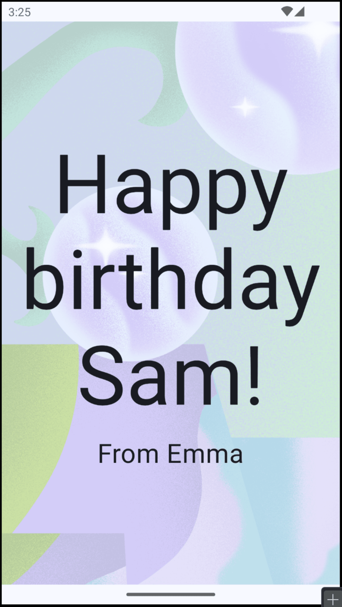
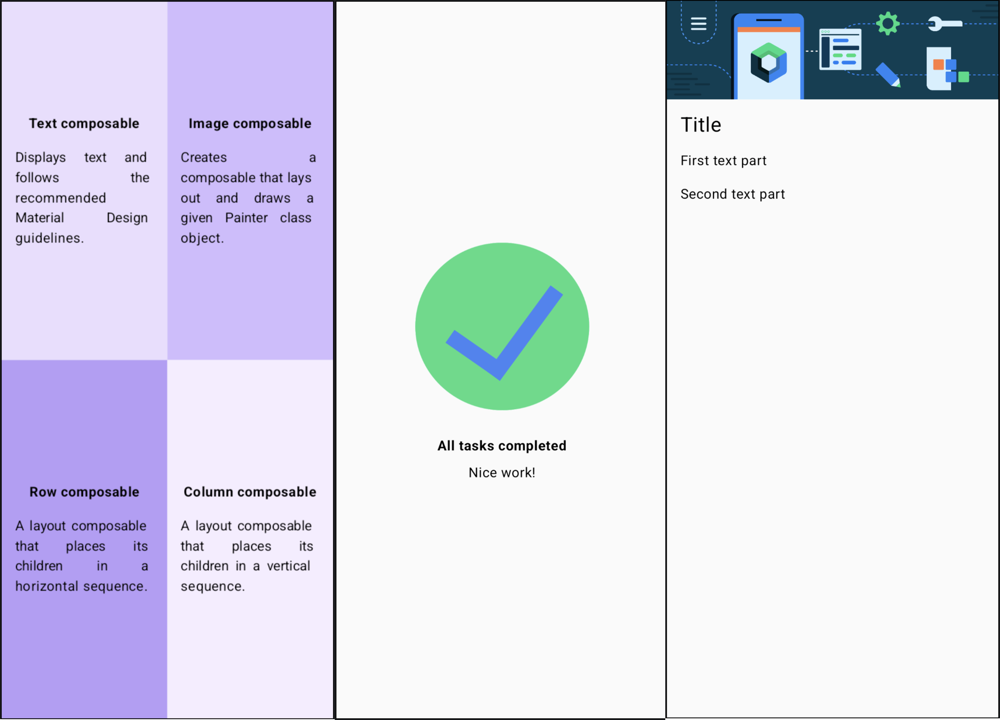
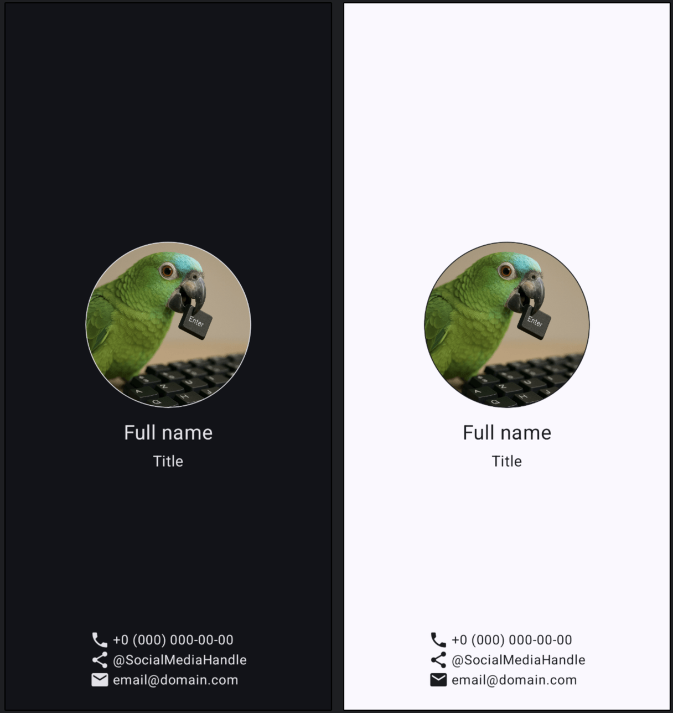

# Unit 1: Your first Android app

The first two pathways were
about [kotlin basics](https://developer.android.com/courses/pathways/android-basics-compose-unit-1-pathway-1)
and [ide setup](https://developer.android.com/courses/pathways/android-basics-compose-unit-1-pathway-2).
There is nothing interesting in them to publish on github. There's codelabs from the third pathway.

## Build a basic layout

Link: https://developer.android.com/courses/pathways/android-basics-compose-unit-1-pathway-3

| Project name and link                   | Codelab link                                                                                                                                                                                                        |                                 Result                                  |
|:----------------------------------------|:--------------------------------------------------------------------------------------------------------------------------------------------------------------------------------------------------------------------|:-----------------------------------------------------------------------:|
| [Texts and image](Textswithimage)       | [Texts codelab link](https://developer.android.com/codelabs/basic-android-kotlin-compose-text-composables) and [Image codelab link](https://developer.android.com/codelabs/basic-android-kotlin-compose-add-images) |  |
| [Practice: Basics](Basicspractice)      | [Codelab link](https://developer.android.com/codelabs/basic-android-kotlin-compose-composables-practice-problems)                                                                                                   |  |
| [Practice: Business Card](BusinessCard) | [Codelab link](https://developer.android.com/codelabs/basic-android-kotlin-compose-business-card)                                                                                                                   |     |
