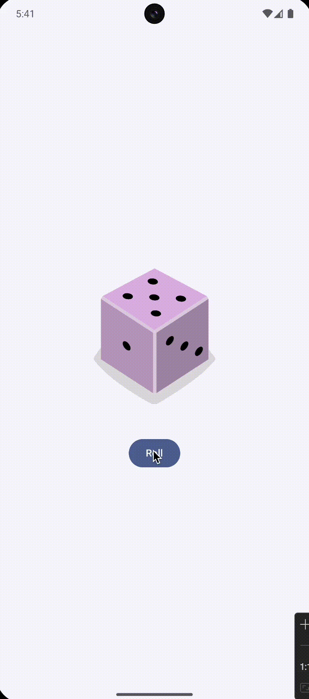

# Unit 2: Building app UI

Links: https://developer.android.com/courses/android-basics-compose/unit-2

The first pathway were
about [kotlin fundamentals](https://developer.android.com/courses/pathways/android-basics-compose-unit-2-pathway-1).
It doesn't have anything interesting to publish on github.

| Pathway                                                                                                                 | Project name and link     | Codelab link                                                                                                                                                                                                       |                                  Result                                  |
|:------------------------------------------------------------------------------------------------------------------------|:--------------------------|:-------------------------------------------------------------------------------------------------------------------------------------------------------------------------------------------------------------------|:------------------------------------------------------------------------:|
| [Add a button to an app](https://developer.android.com/courses/pathways/android-basics-compose-unit-2-pathway-2)        | [Dice Roller](DiceRoller) | [Codelab link](https://developer.android.com/codelabs/basic-android-kotlin-compose-build-a-dice-roller-app)                                                                                                        |       |
|                                                                                                                         | [Lemonade](Lemonade)      | [Codelab link](https://developer.android.com/codelabs/basic-android-kotlin-compose-button-click-practice-problem)                                                                                                  |         |
| [Interacting with UI and state](https://developer.android.com/courses/pathways/android-basics-compose-unit-2-pathway-3) | [Tip Time](TipTime)       | [First codelab link](https://developer.android.com/codelabs/basic-android-kotlin-compose-using-state) and [Second codelab link](https://developer.android.com/codelabs/basic-android-kotlin-compose-calculate-tip) |          |
|                                                                                                                         | [Tip Time](TipTime)       | [Codelab link](https://developer.android.com/codelabs/basic-android-kotlin-compose-write-automated-tests)                                                                                                          |  |
|                                                                                                                         | [Art Space](ArtSpace)     | [Codelab link](https://developer.android.com/codelabs/basic-android-kotlin-compose-art-space)                                                                                                                      |         |
