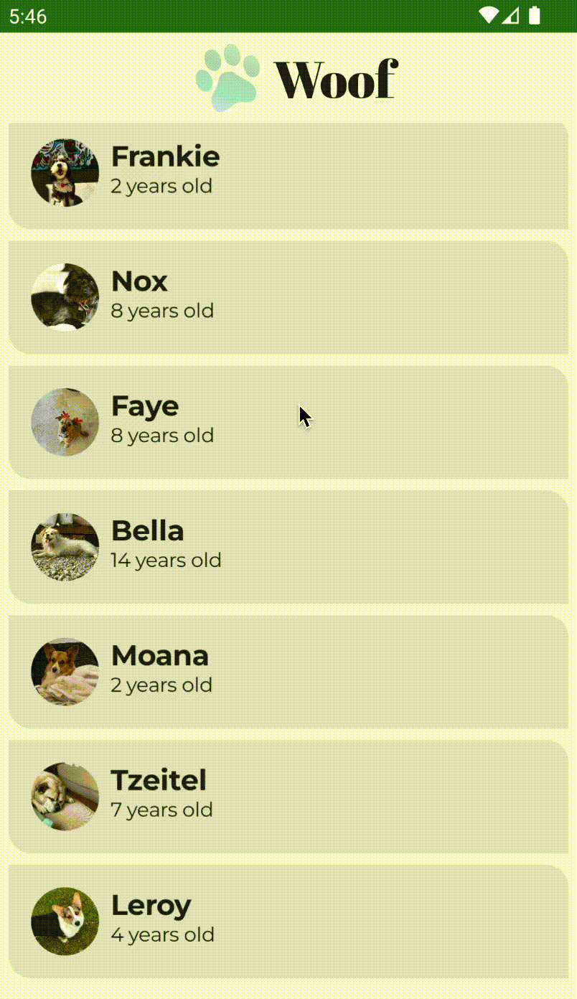

# Unit 3: Display lists and use Material Design

Links: https://developer.android.com/courses/android-basics-compose/unit-3

The first pathway were
about [kotlin fundamentals](https://developer.android.com/courses/pathways/android-basics-compose-unit-3-pathway-1).
It doesn't have anything interesting to publish on github.

| Pathway                                                                                                           | Project name and link        | Codelab link                                                                                                                                                                                                                                                                                                                                                                   |                                Result                                 |
|:------------------------------------------------------------------------------------------------------------------|:-----------------------------|:-------------------------------------------------------------------------------------------------------------------------------------------------------------------------------------------------------------------------------------------------------------------------------------------------------------------------------------------------------------------------------|:---------------------------------------------------------------------:|
| [Build a scrollable list](https://developer.android.com/courses/pathways/android-basics-compose-unit-3-pathway-2) | [Affirmations](Affirmations) | [Scrollable list codelab link](https://developer.android.com/codelabs/basic-android-kotlin-compose-training-add-scrollable-list) and [App icon codelab link](https://developer.android.com/codelabs/basic-android-kotlin-compose-training-change-app-icon)                                                                                                                     |  |
|                                                                                                                   | [Courses](Courses)           | [Practice: Build a Grid](https://developer.android.com/codelabs/basic-android-kotlin-compose-practice-grid)                                                                                                                                                                                                                                                                    |       |
| [Build beautiful apps](https://developer.android.com/courses/pathways/android-basics-compose-unit-3-pathway-3)    | [Woof](Woof)                 | [Material Theming with Jetpack Compose](https://developer.android.com/codelabs/basic-android-kotlin-compose-material-theming) and [Simple animations codelab link](https://developer.android.com/codelabs/basic-android-kotlin-compose-woof-animation) and [Testing for Accessibility](https://developer.android.com/codelabs/basic-android-kotlin-compose-test-accessibility) |          |
|                                                                                                                   | [Superheroes](Superheroes)   | [Practice: Build Superheroes app](https://developer.android.com/codelabs/basic-android-kotlin-compose-practice-superheroes)                                                                                                                                                                                                                                                    |   |
|                                                                                                                   | [30 days](ThirtyDays)        | [Project: Create a 30 Days App](https://developer.android.com/codelabs/basic-android-kotlin-compose-30-days)                                                                                                                                                                                                                                                                   |    |
