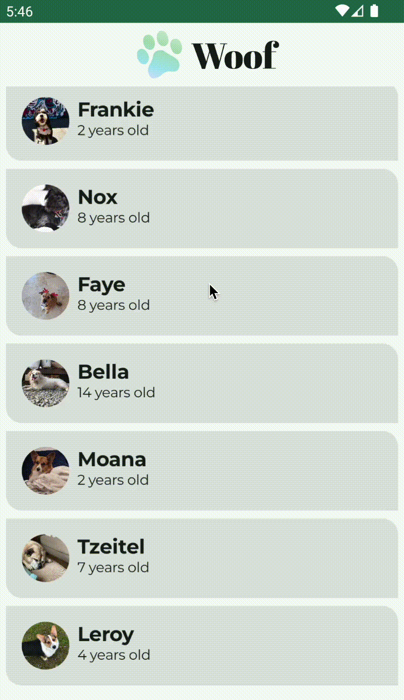

# Woof app

Links: https://developer.android.com/codelabs/basic-android-kotlin-compose-material-theming

### Fonts

This project uses the following fonts under the SIL Open Font License 1.1:

- **Abril Fatface**  
  Copyright © 2011, TypeTogether  
  Reserved Font Names: "Abril" and "Abril Fatface"  
  [https://type-together.com](https://type-together.com)

- **Montserrat**  
  Copyright © 2024, The Montserrat.Git Project Authors  
  [https://github.com/JulietaUla/Montserrat.git](https://github.com/JulietaUla/Montserrat.git)

These fonts are licensed under the [SIL Open Font License, Version 1.1](https://openfontlicense.org).
The full license text is [here](License_fonts.txt).

