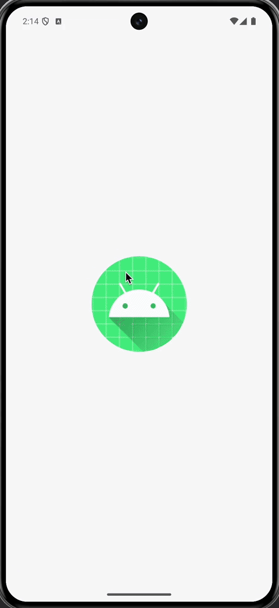
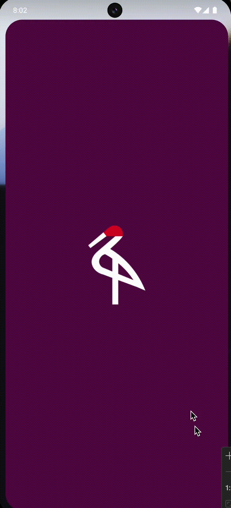
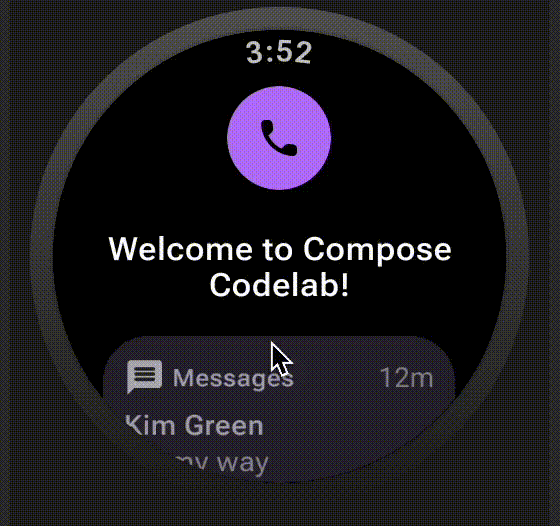

# Jetpack Compose course

### And other compose codelabs

Link: https://developer.android.com/courses/jetpack-compose/course

| Project name and link                                 | Codelab link                                                                                       |                                        Result                                        |
|:------------------------------------------------------|:---------------------------------------------------------------------------------------------------|:------------------------------------------------------------------------------------:|
| [Basics](Basics)                                      | [Codelab link](https://developer.android.com/codelabs/jetpack-compose-basics)                      |                       |
| [State](State)                                        | [Codelab link](https://developer.android.com/codelabs/jetpack-compose-state)                       |                        |
| [Basic layouts](Basic%20layouts)                      | [Codelab link](https://developer.android.com/codelabs/jetpack-compose-layouts)                     |              |
| [Migration](Migration)                                | [Codelab link](https://developer.android.com/codelabs/jetpack-compose-migration)                   |                    |
| [Theming](Theming)                                    | [Codelab link](https://developer.android.com/codelabs/jetpack-compose-theming)                     |                      |
| [Animation](Animation)                                | [Codelab link](https://developer.android.com/codelabs/jetpack-compose-animation)                   |                    |
| [State and side effects](AdvancedStateAndSideEffects) | [Codelab link](https://developer.android.com/codelabs/jetpack-compose-advanced-state-side-effects) |  |
| [Navigation](Navigation)                              | [Codelab link](https://developer.android.com/codelabs/jetpack-compose-navigation)                  |                   |
| [Testing](Testing)                                    | [Codelab link](https://developer.android.com/codelabs/jetpack-compose-testing)                     |                      |
| [Accessibility](Accessibility)                        | [Codelab link](https://developer.android.com/codelabs/jetpack-compose-accessibility)               |                 |
| [Adaptive app](Adaptiveapps)                          | [Codelab link](https://codelabs.developers.google.com/jetpack-compose-adaptability)                |                  |
| [WearOS](WearOS)                                      | [Codelab link](https://developer.android.com/codelabs/compose-for-wear-os)                         |                        |
