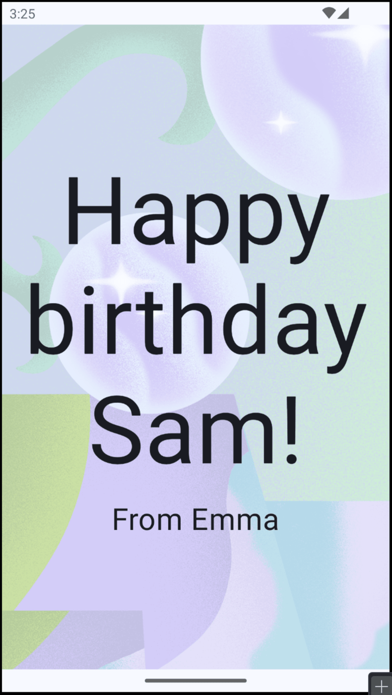
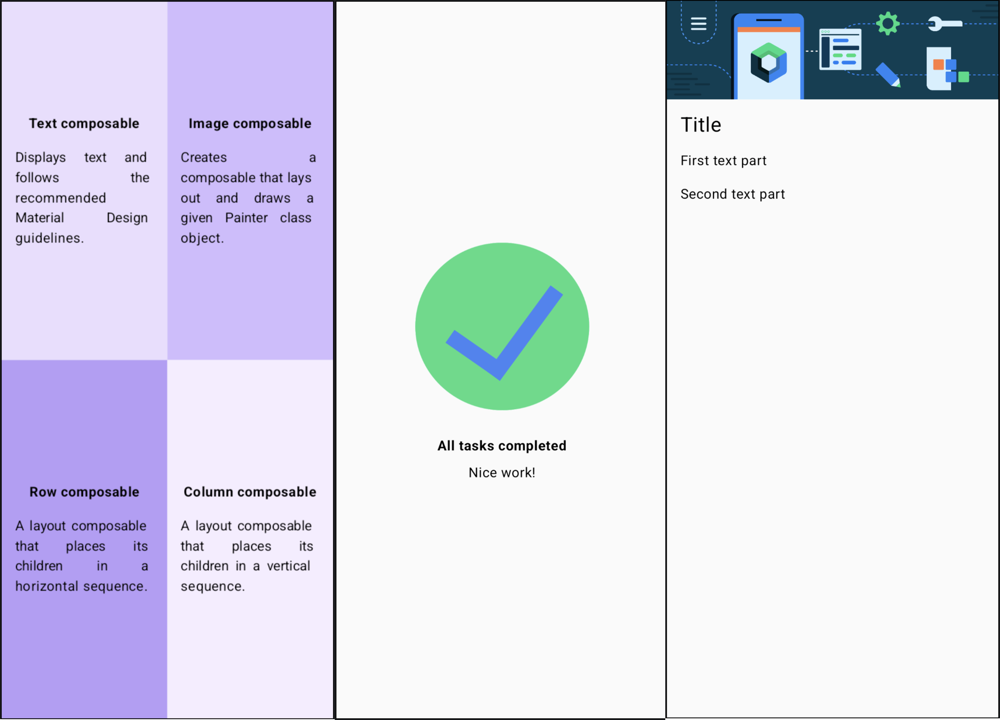
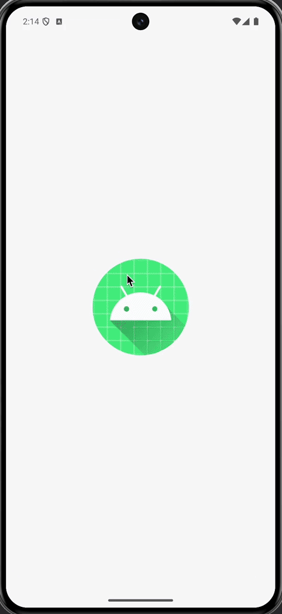
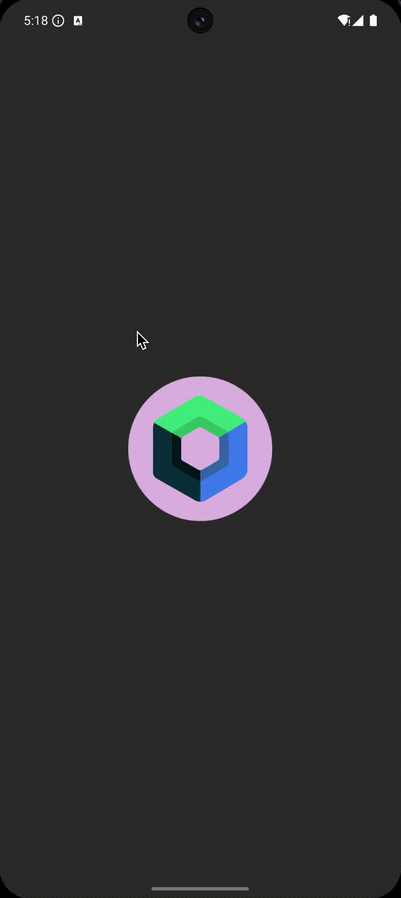
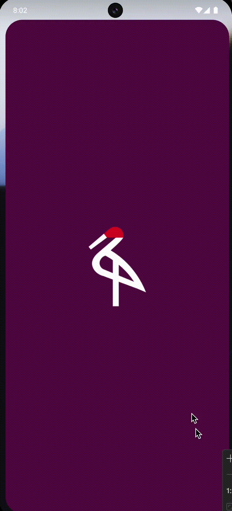
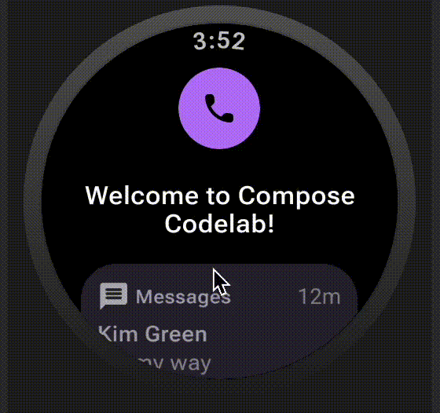

# Codelabs

| Project name and link                                                 | Codelab link                                                                                                                                                                                                        |                                            Result                                            |
|:----------------------------------------------------------------------|:--------------------------------------------------------------------------------------------------------------------------------------------------------------------------------------------------------------------|:--------------------------------------------------------------------------------------------:|
| [Compose Texts and image](Compose/Textswithimage)                     | [Texts codelab link](https://developer.android.com/codelabs/basic-android-kotlin-compose-text-composables) and [Image codelab link](https://developer.android.com/codelabs/basic-android-kotlin-compose-add-images) |               |
| [Compose Practice: Basics](Compose/Basicspractice)                    | [Codelab link](https://developer.android.com/codelabs/basic-android-kotlin-compose-composables-practice-problems)                                                                                                   |               |
| [Compose Basics](Compose/Basics)                                      | [Codelab link](https://developer.android.com/codelabs/jetpack-compose-basics)                                                                                                                                       |                       |
| [Compose State](Compose/State)                                        | [Codelab link](https://developer.android.com/codelabs/jetpack-compose-state)                                                                                                                                        |                        |
| [Compose Basic layouts](<Compose/Basic layouts>)                      | [Codelab link](https://developer.android.com/codelabs/jetpack-compose-layouts)                                                                                                                                      |              |
| [Compose Migration](Compose/Migration)                                | [Codelab link](https://developer.android.com/codelabs/jetpack-compose-migration)                                                                                                                                    |                    |
| [Compose Theming](Compose/Theming)                                    | [Codelab link](https://developer.android.com/codelabs/jetpack-compose-theming)                                                                                                                                      |                      |
| [Compose Animation](Compose/Animation)                                | [Codelab link](https://developer.android.com/codelabs/jetpack-compose-animation)                                                                                                                                    |                    |
| [Compose State and side effects](Compose/AdvancedStateAndSideEffects) | [Codelab link](https://developer.android.com/codelabs/jetpack-compose-advanced-state-side-effects)                                                                                                                  |  |
| [Compose Navigation](Compose/Navigation)                              | [Codelab link](https://developer.android.com/codelabs/jetpack-compose-navigation)                                                                                                                                   |                   |
| [Compose Testing](Compose/Testing)                                    | [Codelab link](https://developer.android.com/codelabs/jetpack-compose-testing)                                                                                                                                      |                      |
| [Compose Accessibility](Compose/Accessibility)                        | [Codelab link](https://developer.android.com/codelabs/jetpack-compose-accessibility)                                                                                                                                |                 |
| [Compose Adaptive app](Compose/Adaptiveapps)                          | [Codelab link](https://codelabs.developers.google.com/jetpack-compose-adaptability)                                                                                                                                 |                  |
| [Compose Adaptive app](Compose/WearOS)                                | [Codelab link](https://developer.android.com/codelabs/compose-for-wear-os)                                                                                                                                          |                        |
